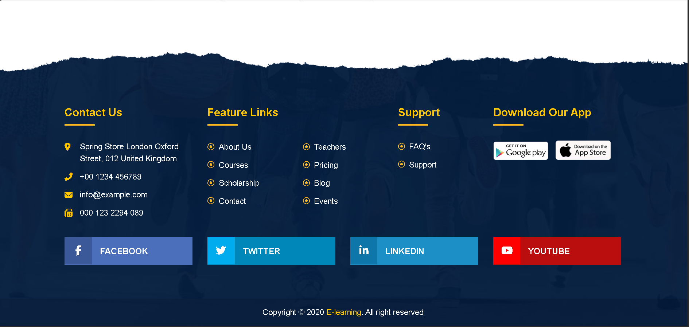

# E-Learning Homepage Clone

Frontend clone of an E-learning website homepage built using HTML and CSS.

**Live Demo:** https://Imranhabib123.github.io/elearning-homepage-clone

## Technologies Used
- HTML
- CSS
- Font Awesome

## Screenshot

## Features
- Header and Navigation
- Courses Section
- Events Section
- Gallery
- Pricing
- Blog Section
- Footer

## Note
This project currently includes only desktop layout.
Responsive design will be added later.

## Author
Imran Shaikh
